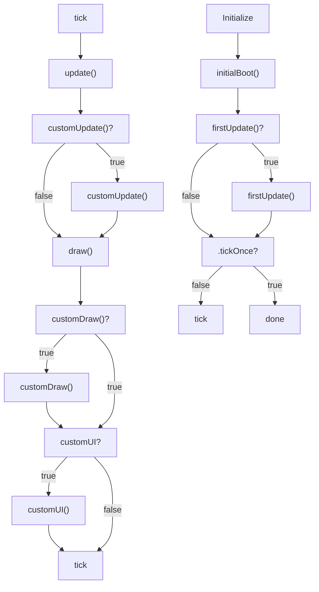

# Flow

After setting up the DOM, styles, options, and mouse events, `canvas.js` calls `initialBoot`. This is called only once and is the first function called. First, this functions checks if there is a `firstUpdate` function provided by the user. This function is designed for the user to set values on the `options` variable before the game loop starts. After checkking for `firstUpdate` and calling it if it exists, `initialBoot` then called the internal `update` function.

 `update` sets the canvas to be the size of the webpage and then calls `customUpdate` if it exists. This is a chance for the user to update state before drawing. After `customUpdate`, then `drawCanvas`is called. 

`drawCanvas` clears the canvas with the fill color specified in `options`, saves the state of the transform stack, applies translation and scaling to reflection the position and zoom of the camera, and then calls `customDraw` if it exists.  `customDraw` is where all drawing should take place.

If the `tickOnce` option is defined and true, the the internal `tick` command is not called and there will be non more updates. If not, a repeating timer is set which calls `tick` repeatedly. 

`tick` stores the current time and then calls `update` and `drawCanvas` as explained.

## Flow Diagram

